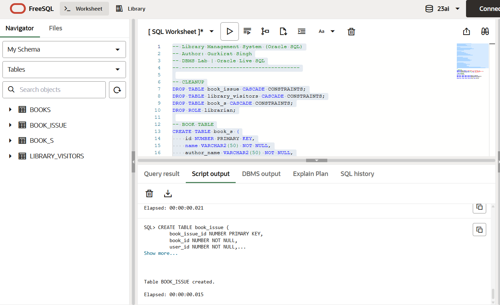
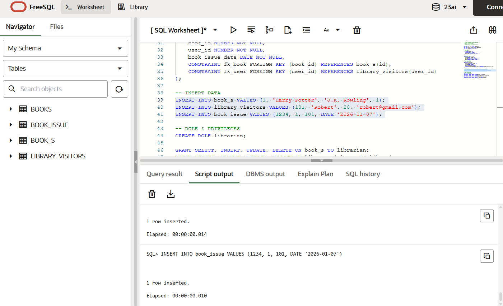

# 📚 Library Management System Database (DBMS Lab)

## 👤 Author
**Gurkirat Singh**  
DBMS Laboratory | Oracle SQL  

---

## 🧪 Experiment Title
**Design and Implementation of a Library Management System Database Using DDL, DML, and DCL Commands**

---

## 🎯 Objective

The objective of this experiment is to design and implement a Library Management System database using SQL.  
This experiment focuses on:

- Creating relational tables with appropriate **primary keys, foreign keys, and constraints**
- Performing **DDL (Data Definition Language)** operations
- Performing **DML (Data Manipulation Language)** operations
- Implementing **DCL (Data Control Language)** commands for role-based security
- Managing database access using **roles, GRANT, and REVOKE**

---

## 🛠 Software Requirements

- **Database Management System:** Oracle SQL  
- **Database Tool:** Oracle Live SQL / SQL*Plus  

---

## 🧠 Experiment Description

A library requires a database system to manage information about books, members, and book issue records efficiently.  
The system is designed to maintain data integrity and security using constraints and role-based access control.

---

## 🧪 Practical / Experiment Steps  
*(In place of Experiment Question)*

1. Create tables for managing books, library visitors, and book issue records.
2. Apply constraints such as PRIMARY KEY, FOREIGN KEY, NOT NULL, UNIQUE, and CHECK.
3. Insert sample data into all tables.
4. Create a database role named **Librarian**.
5. Grant SELECT, INSERT, UPDATE, and DELETE privileges to the role.
6. Revoke privileges to demonstrate role-based security.

---

## ⚙️ Procedure of the Experiment

1. Drop existing tables and roles to avoid conflicts.
2. Create tables using DDL commands.
3. Insert sample records using DML commands.
4. Create a role and assign privileges using DCL commands.
5. Revoke privileges to control access.

---

## 🧾 Input / Output Details and Screenshots  
*(Based on I/O Analysis)*
### Create Students Table

### Insert Student Records

### Input
- SQL commands for table creation
- INSERT statements for data entry
- Role creation and privilege management commands

### Output
- Tables created successfully
- Records inserted without constraint violations
- Role created and privileges granted/revoked successfully

📸 Screenshots included in the repository show:
- Table creation output
- Data insertion confirmation
- Role creation
- GRANT and REVOKE execution

---

## 🎓 Learning Outcome

After completing this experiment, the following concepts were learned:

- Designing relational databases using Oracle SQL
- Applying constraints to maintain data integrity
- Understanding and implementing DDL, DML, and DCL operations
- Implementing role-based access control for database security
- Gaining hands-on experience with Oracle SQL

---

## ✅ Conclusion

This experiment demonstrates the successful design and implementation of a secure and efficient Library Management System database.  
The use of constraints and role-based privileges ensures data integrity and controlled access, making the system suitable for real-world database applications.
