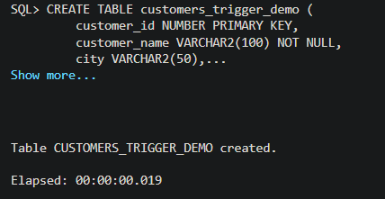
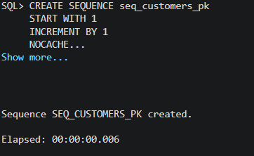
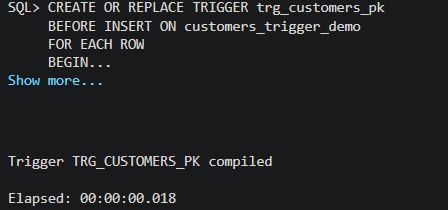
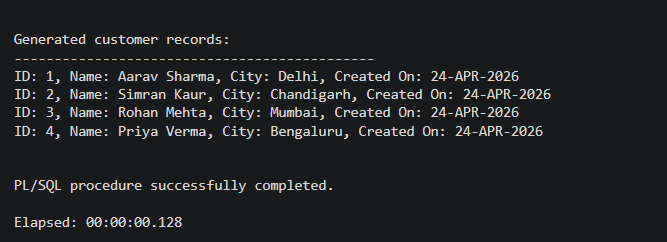

# 📘 Experiment 10: Trigger for Automatic Primary Key Functionality

---

## 🎯 Aim
To design a database trigger that automatically generates primary key values, ensuring unique identification of records without manual intervention.

---

## 🧰 Software Requirements

- **Database:** Oracle Database Express Edition (Oracle XE)  
- **Tool:** Oracle SQL Developer / SQL*Plus  

---

## 📌 Objective

- To implement automatic primary key generation using triggers  
- To eliminate manual key assignment errors  
- To ensure data integrity and uniqueness  

---

## ❓ Problem Statement

In real-world database systems, manually assigning primary keys can lead to:

- Duplicate values  
- Human errors  
- Scalability issues  

### ✔️ Solution
Design a trigger that:
- Automatically assigns a unique primary key before insertion  
- Uses a sequence for generating values  
- Requires no manual intervention  

---

## ⚙️ Implementation Steps

1. Create a table with a primary key column  
2. Create a sequence for generating unique IDs  
3. Create a trigger (BEFORE INSERT)  
4. Insert records without specifying primary key  
5. Validate automatic key generation  

---

## 🧪 Execution & Output

### 🔹 Table Creation

---

### 🔹 Sequence Creation

---

### 🔹 Trigger Creation

---

### 🔹 Final Output

---

## 📊 Sample Output

Generated customer records:

ID: 1, Name: Aarav Sharma, City: Delhi, Created On: 24-APR-2026
ID: 2, Name: Simran Kaur, City: Chandigarh, Created On: 24-APR-2026
ID: 3, Name: Rohan Mehta, City: Mumbai, Created On: 24-APR-2026
ID: 4, Name: Priya Verma, City: Bengaluru, Created On: 24-APR-2026

---

## 🎓 Learning Outcome

After completing this experiment, the learner is able to:

- Understand how database triggers work  
- Implement automatic primary key generation  
- Maintain data consistency and integrity  
- Apply this concept in real-world systems  

---

## 🧠 Conclusion

Triggers combined with sequences provide an efficient way to automate primary key generation.  
This approach reduces manual errors, ensures uniqueness, and is widely used in enterprise-level applications.

---

## 📁 Project Structure

.
├── README.md
├── experiment.sql
└── screenshots/
├── 1.png
├── 2.png
├── 3.png
└── 4.png

---

## 🚀 Industry Relevance

This concept is widely used in:

- Amazon → Order ID generation  
- Flipkart → Customer/Product IDs  
- Banking Systems → Transaction IDs  
- Enterprise Applications → Record Management  

---