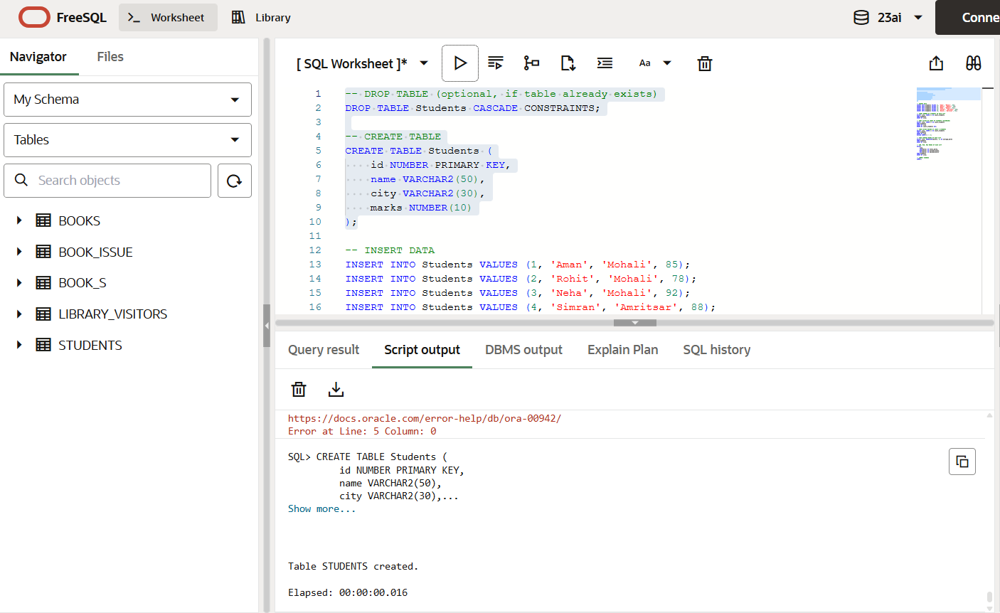
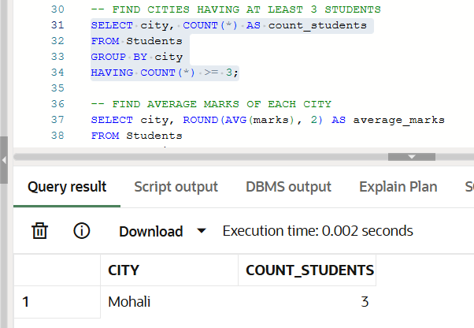
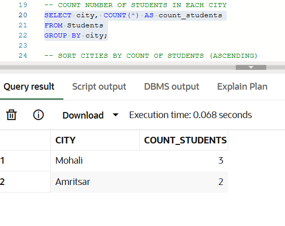
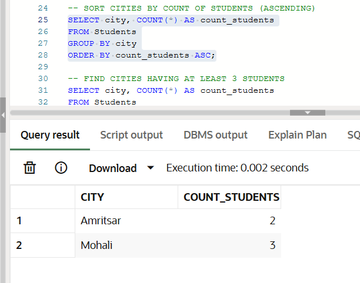
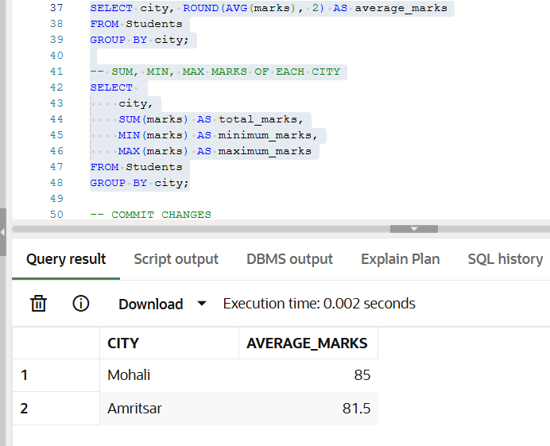
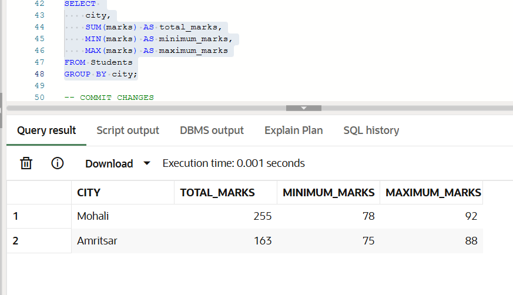

# 🎓 Student City-wise Analysis Using SQL (DBMS Lab)

## 👤 Author  
**Gurkirat Singh**  
DBMS Laboratory | Oracle SQL  

---

## 🧪 Experiment Title  
**Analysis of Student Records Using Aggregate Functions and Grouping in Oracle SQL**

---

## 🎯 Objective  

The objective of this experiment is to understand and implement **aggregate functions** and **grouping operations** in SQL.  
This experiment focuses on analyzing student data city-wise using SQL clauses such as:

- `GROUP BY`
- `HAVING`
- `ORDER BY`
- Aggregate functions: `COUNT`, `AVG`, `SUM`, `MIN`, `MAX`

---

## 🛠 Software Requirements  

- **Database Management System:** Oracle SQL  
- **Database Tool:** Oracle Live SQL / SQL*Plus  

---

## 🧠 Experiment Description  

An organization maintains student records containing information such as student ID, name, city, and marks.  
The goal of this experiment is to analyze the data city-wise to:

- Count the number of students in each city  
- Sort cities based on student count  
- Identify cities having a minimum number of students  
- Calculate average, total, minimum, and maximum marks per city  

---

## 🧪 Practical / Experiment Steps  
*(In place of Experiment Question)*  

1. Create a `Students` table with appropriate data types.  
2. Insert sample student records into the table.  
3. Use aggregate functions to analyze data city-wise.  
4. Apply `GROUP BY` to group records by city.  
5. Use `HAVING` to filter grouped data.  
6. Sort the results using `ORDER BY`.  

---

## ⚙️ Procedure of the Experiment  

1. Drop the `Students` table if it already exists to avoid conflicts.  
2. Create the `Students` table using DDL commands.  
3. Insert student records using DML commands.  
4. Execute SELECT queries using aggregate functions and grouping.  
5. Commit the changes to the database.  

---

## 🧾 Input / Output Details and Screenshots  
*(Based on I/O Analysis)*  

### Table Creation

*Figure 1: Creation of Students table using DDL commands*

### Data Insertion

*Figure 2: Insertion of student records into the table*

### Count Number of Students in Each City

*Figure 3: City-wise count of students using GROUP BY clause*

### Sort Cities by Student Count

*Figure 4: Sorting cities based on student count using ORDER BY*

### Average Marks of Each City

*Figure 5: Calculation of average marks city-wise*

### SUM, MIN, MAX Marks of Each City

*Figure 6: Aggregate functions SUM, MIN, and MAX applied city-wise*

### Input  
- SQL commands for:
  - Table creation  
  - Data insertion  
  - Aggregate queries using GROUP BY, HAVING, and ORDER BY  

### Output  
- City-wise count of students  
- Sorted list of cities based on student count  
- Cities having at least 3 students  
- Average marks per city  
- Total, minimum, and maximum marks per city  

📸 Screenshots included in the repository show:
- Table creation  
- Data insertion  
- Execution of each SELECT query with output  

---

## 🎓 Learning Outcome  

After completing this experiment, the following learning outcomes were achieved:

- Understanding of aggregate functions in SQL  
- Practical use of GROUP BY and HAVING clauses  
- Ability to analyze data using SQL queries  
- Improved understanding of data summarization techniques  
- Hands-on experience with Oracle SQL  

---

## ✅ Conclusion  

This experiment successfully demonstrates how SQL aggregate functions and grouping can be used to analyze student data effectively.  
The use of `GROUP BY`, `HAVING`, and `ORDER BY` allows meaningful insights to be extracted from raw data, making SQL a powerful tool for data analysis.
