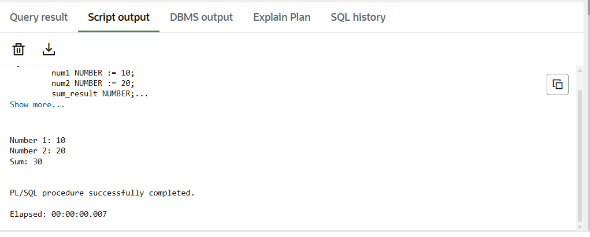

# Experiment 2: Basic Structure of PL/SQL Block

## 📌 Aim
To design and implement a simple PL/SQL program that demonstrates the basic structure of a PL/SQL block using a declaration section and an execution section, and to display the output using appropriate output statements.

---

## 🎯 Objectives
- To understand the basic structure of a PL/SQL block  
- To learn variable declaration in PL/SQL  
- To perform simple arithmetic operations  
- To display output using `DBMS_OUTPUT.PUT_LINE`  

---

## 🧠 Description
PL/SQL (Procedural Language / SQL) is an extension of SQL that allows procedural programming.  
This experiment demonstrates a **basic PL/SQL block**, which consists of:
- Declaration section (`DECLARE`)
- Execution section (`BEGIN … END`)

The program calculates the **sum of two numbers** and displays the input values and result.

---

## 🛠️ Tools & Technologies
- Oracle SQL / Oracle SQL Developer  
- PL/SQL  

---

## ▶️ Program Code

```sql
SET SERVEROUTPUT ON;

DECLARE
    num1 NUMBER := 10;
    num2 NUMBER := 20;
    sum_result NUMBER;
BEGIN
    sum_result := num1 + num2;

    DBMS_OUTPUT.PUT_LINE('Number 1: ' || num1);
    DBMS_OUTPUT.PUT_LINE('Number 2: ' || num2);
    DBMS_OUTPUT.PUT_LINE('Sum: ' || sum_result);
END;
/

---

## Screenshot:



---

## 📤 Output

Number 1: 10
Number 2: 20
Sum: 30

---

## 📚 Learning Outcomes

Understood the structure of a PL/SQL block

Learned how to declare and use variables in PL/SQL

Gained experience in executing PL/SQL programs

Learned to display output using Oracle built-in packages
---

## ✅ Result

The PL/SQL program was successfully executed and the output was displayed, demonstrating the basic structure of a PL/SQL 

block.

---