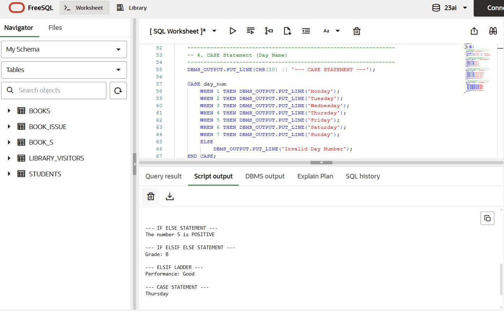

# 📘 Experiment 4: Conditional Control Statements in PL/SQL

## 🧪 Aim
To design and implement PL/SQL programs using conditional control statements such as **IF–ELSE**, **IF–ELSIF–ELSE**, **ELSIF ladder**, and **CASE statements** to control the flow of execution based on given logical conditions.

---

## 💻 Software Requirements
- **Database Management System:** Oracle Database  
- **SQL Environment:** Oracle Live SQL / Oracle SQL Developer  

---

## 🎯 Objective
To implement decision-making control structures in PL/SQL and understand how the flow of execution is controlled based on conditions.

---

## 📄 Problem Statement
Develop and execute PL/SQL programs that demonstrate the use of conditional control statements.  
The programs should use:
- IF–ELSE  
- IF–ELSIF–ELSE  
- ELSIF Ladder  
- CASE Statement  

to evaluate conditions and control program flow.

---

## 🛠️ Program Code

```sql
SET SERVEROUTPUT ON;

DECLARE
    num       NUMBER := 5;
    marks1    NUMBER := 82;
    marks2    NUMBER := 68;
    day_num   NUMBER := 4;
BEGIN
    -- 1. IF ELSE
    DBMS_OUTPUT.PUT_LINE('--- IF ELSE STATEMENT ---');

    IF num > 0 THEN
        DBMS_OUTPUT.PUT_LINE('The number ' || num || ' is POSITIVE');
    ELSE
        DBMS_OUTPUT.PUT_LINE('The number ' || num || ' is NON-POSITIVE');
    END IF;

    -- 2. IF ELSIF ELSE
    DBMS_OUTPUT.PUT_LINE('--- IF ELSIF ELSE STATEMENT ---');

    IF marks1 >= 90 THEN
        DBMS_OUTPUT.PUT_LINE('Grade: A');
    ELSIF marks1 >= 75 THEN
        DBMS_OUTPUT.PUT_LINE('Grade: B');
    ELSIF marks1 >= 60 THEN
        DBMS_OUTPUT.PUT_LINE('Grade: C');
    ELSE
        DBMS_OUTPUT.PUT_LINE('Grade: FAIL');
    END IF;

    -- 3. ELSIF LADDER
    DBMS_OUTPUT.PUT_LINE('--- ELSIF LADDER ---');

    IF marks2 >= 85 THEN
        DBMS_OUTPUT.PUT_LINE('Performance: Excellent');
    ELSIF marks2 >= 70 THEN
        DBMS_OUTPUT.PUT_LINE('Performance: Very Good');
    ELSIF marks2 >= 55 THEN
        DBMS_OUTPUT.PUT_LINE('Performance: Good');
    ELSIF marks2 >= 40 THEN
        DBMS_OUTPUT.PUT_LINE('Performance: Average');
    ELSE
        DBMS_OUTPUT.PUT_LINE('Performance: Poor');
    END IF;

    -- 4. CASE STATEMENT
    DBMS_OUTPUT.PUT_LINE('--- CASE STATEMENT ---');

    CASE day_num
        WHEN 1 THEN DBMS_OUTPUT.PUT_LINE('Monday');
        WHEN 2 THEN DBMS_OUTPUT.PUT_LINE('Tuesday');
        WHEN 3 THEN DBMS_OUTPUT.PUT_LINE('Wednesday');
        WHEN 4 THEN DBMS_OUTPUT.PUT_LINE('Thursday');
        WHEN 5 THEN DBMS_OUTPUT.PUT_LINE('Friday');
        WHEN 6 THEN DBMS_OUTPUT.PUT_LINE('Saturday');
        WHEN 7 THEN DBMS_OUTPUT.PUT_LINE('Sunday');
        ELSE
            DBMS_OUTPUT.PUT_LINE('Invalid Day Number');
    END CASE;

END;
/

```

## 📊 Output



The program displays:

Whether a number is positive or non-positive

Grade of a student based on marks

Performance status using an ELSIF ladder

Name of the day using a CASE statement

(Output varies depending on input values.)

---

## 🧠 Explanation

IF–ELSE is used for simple decision-making

IF–ELSIF–ELSE handles multiple conditions

ELSIF ladder evaluates conditions step-by-step

CASE statement is best suited for fixed value comparisons

---

## ✅ Result
The PL/SQL program executed successfully and demonstrated conditional control statements for decision-making.

---

## 📝 Conclusion
Conditional control statements in PL/SQL improve program logic and readability by allowing decision-based execution.