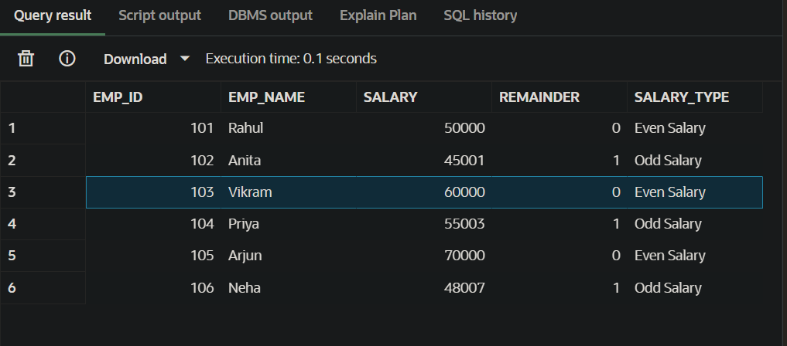

# SQL Practical: Table Management and Conditional Logic (Oracle)

## Overview
This project demonstrates basic **SQL table management and conditional logic** using an Oracle SQL environment. The experiment focuses on creating a database table, inserting records, and using SQL functions and conditional expressions to analyze numerical data.

The primary task performed in this experiment is checking whether employee salaries are **even or odd** using the **MOD() function** and **CASE expression**.

This practical helps students understand how SQL can be used not only to store and retrieve data but also to perform logical analysis directly within queries.

---

# Objectives
The main objectives of this experiment are:

- To learn how to **create and manage database tables**.
- To understand how to **delete existing tables safely**.
- To practice inserting records using **Data Manipulation Language (DML)**.
- To understand the use of the **MOD() function** for remainder calculation.
- To apply **conditional logic using CASE expressions**.
- To perform **data retrieval and analysis using SELECT queries**.

---

# Technologies Used
- Oracle Database / Oracle FreeSQL
- SQL
- SQL Developer or SQL*Plus

---

# Database Schema

## Table: `employee`

| Column Name | Data Type | Description |
|-------------|-----------|-------------|
| emp_id | NUMBER | Unique Employee ID (Primary Key) |
| emp_name | VARCHAR2(50) | Name of the Employee |
| salary | NUMBER | Salary of the Employee |

The `emp_id` field acts as the **Primary Key**, ensuring that each employee record is unique.

---

# Key SQL Concepts Used

## 1. Data Definition Language (DDL)
DDL commands define the structure of database objects.

Examples used in this experiment:
- `CREATE TABLE`
- `DROP TABLE`

These commands allow us to create and remove tables from the database.

---

## 2. Data Manipulation Language (DML)
DML commands are used to manipulate the data stored inside tables.

Example used:
- `INSERT INTO`

This command allows us to add records to the employee table.

---

## 3. Data Query Language (DQL)
DQL commands are used to retrieve data from the database.

Example used:
- `SELECT`

The SELECT statement retrieves employee records and performs logical classification of salaries.

---

# MOD Function
Oracle SQL does not use the `%` operator for modulo calculations. Instead, it uses the **MOD() function**.

### Syntax
MOD(number, divisor)


### Example

MOD(10,2) = 0
MOD(15,2) = 1


If the remainder is **0**, the number is even.  
If the remainder is **1**, the number is odd.

---

# CASE Expression
The **CASE expression** allows SQL queries to implement conditional logic similar to `if-else` statements in programming languages.

### Syntax
```sql
CASE
    WHEN condition THEN result
    ELSE result
END
``` 

## Salary Classification Using CASE Expression

In this experiment, the **CASE expression** is used to categorize salaries as:

- **Even Salary**
- **Odd Salary**

---

# Implementation Steps

## Step 1: Remove Existing Table

To avoid conflicts, the experiment first checks if an `employee` table already exists and removes it.

```sql
BEGIN
   EXECUTE IMMEDIATE 'DROP TABLE employee';
EXCEPTION
   WHEN OTHERS THEN
      IF SQLCODE != -942 THEN
         RAISE;
      END IF;
END;
```
This ensures that the script runs without errors even if the table does not exist.

---

## Step 2: Create Employee Table

```sql
CREATE TABLE employee (
    emp_id NUMBER PRIMARY KEY,
    emp_name VARCHAR2(50),
    salary NUMBER
);
```

This command creates the `employee` table with three attributes:
- `emp_id`: Employee ID (Primary Key)
- `emp_name`: Employee Name
- `salary`: Employee Salary

---

## Step 3: Insert Sample Records

```sql
INSERT INTO employee VALUES (101, 'Rahul', 50000);
INSERT INTO employee VALUES (102, 'Anita', 45001);
INSERT INTO employee VALUES (103, 'Vikram', 60000);
INSERT INTO employee VALUES (104, 'Priya', 55003);
INSERT INTO employee VALUES (105, 'Arjun', 70000);
INSERT INTO employee VALUES (106, 'Neha', 48007);

COMMIT;
```

Six employee records are inserted into the table.

---

## Step 4: Perform Conditional Query

```sql
SELECT
    emp_id,
    emp_name,
    salary,
    MOD(salary, 2) AS remainder,
    CASE
        WHEN MOD(salary, 2) = 0 THEN 'Even Salary'
        ELSE 'Odd Salary'
    END AS salary_type
FROM employee;
```

### Query Explanation

This query performs the following tasks:
- Retrieves employee details
- Calculates the remainder when salary is divided by 2 using `MOD()` function
- Classifies salaries as **Even Salary** or **Odd Salary** using `CASE` expression

---

## Expected Output

| EMP_ID | EMP_NAME | SALARY | REMAINDER | SALARY_TYPE  |
|--------|----------|--------|-----------|--------------|
| 101    | Rahul    | 50000  | 0         | Even Salary  |
| 102    | Anita    | 45001  | 1         | Odd Salary   |
| 103    | Vikram   | 60000  | 0         | Even Salary  |
| 104    | Priya    | 55003  | 1         | Odd Salary   |
| 105    | Arjun    | 70000  | 0         | Even Salary  |
| 106    | Neha     | 48007  | 1         | Odd Salary   |


---

## Observations

- The `employee` table was successfully created
- Records were inserted without any constraint violations
- The `MOD()` function correctly calculated remainders
- The `CASE` expression properly classified salaries
- The `SELECT` query generated an additional computed column (`salary_type`)

---

## Result

The experiment successfully demonstrated how SQL can be used to manage database tables and perform conditional logic. The salaries of employees were correctly classified as **Even Salary** or **Odd Salary** using the `MOD()` function and `CASE` expression.

---

## Learning Outcomes

After completing this experiment, the following skills were gained:

1. Understanding of SQL table lifecycle management
2. Practical knowledge of inserting and retrieving records
3. Ability to perform logical classification using SQL
4. Experience using built-in functions like `MOD()`
5. Familiarity with `CASE` expressions for conditional logic

---

## Complete SQL Script

```sql
-- Drop existing table
BEGIN
   EXECUTE IMMEDIATE 'DROP TABLE employee';
EXCEPTION
   WHEN OTHERS THEN
      IF SQLCODE != -942 THEN
         RAISE;
      END IF;
END;

-- Create employee table
CREATE TABLE employee (
    emp_id NUMBER PRIMARY KEY,
    emp_name VARCHAR2(50),
    salary NUMBER
);

-- Insert sample records
INSERT INTO employee VALUES (101, 'Rahul', 50000);
INSERT INTO employee VALUES (102, 'Anita', 45001);
INSERT INTO employee VALUES (103, 'Vikram', 60000);
INSERT INTO employee VALUES (104, 'Priya', 55003);
INSERT INTO employee VALUES (105, 'Arjun', 70000);
INSERT INTO employee VALUES (106, 'Neha', 48007);

COMMIT;

-- Perform conditional query
SELECT
    emp_id,
    emp_name,
    salary,
    MOD(salary, 2) AS remainder,
    CASE
        WHEN MOD(salary, 2) = 0 THEN 'Even Salary'
        ELSE 'Odd Salary'
    END AS salary_type
FROM employee;
```

---

**Author**: SQL Practical Experiment  
**Environment**: Oracle Database

