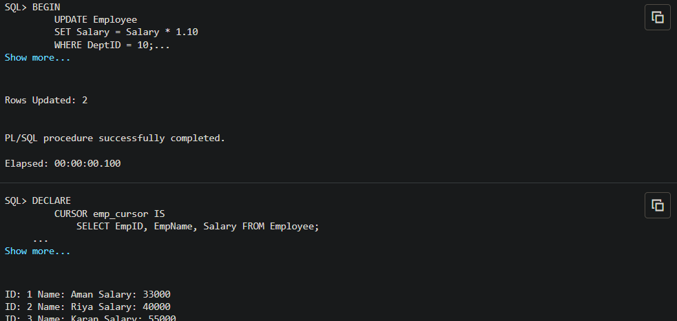
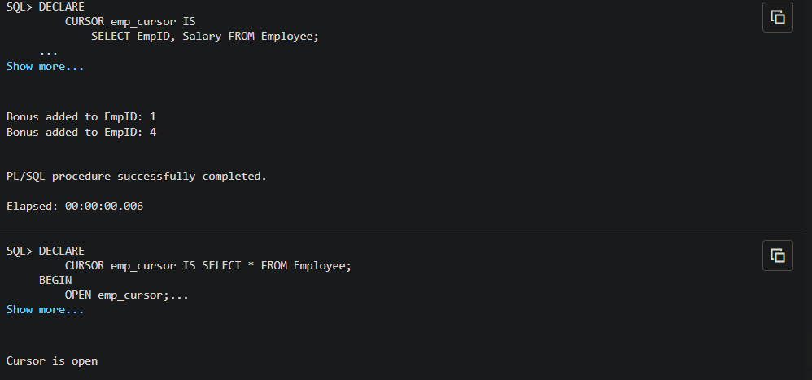

# README – Experiment 6

## Understanding and Implementing Cursors in PL/SQL

---

## 📌 Overview

This experiment demonstrates the use of **cursors in PL/SQL** to process database records row by row. It covers both **implicit** and **explicit cursors**, along with cursor attributes used to control execution flow.

Cursors are essential in database programming when dealing with multi-row query results that require custom business logic per row.

---

## 🎯 Aim

To understand and implement:
- Implicit cursors
- Explicit cursors
- Cursor attributes

For performing row-by-row data processing in PL/SQL.

---

## 🎯 Objectives

- Understand how cursors work in PL/SQL
- Differentiate between implicit and explicit cursors
- Process multiple rows using explicit cursors
- Use cursor attributes like:
  - `%FOUND`
  - `%NOTFOUND`
  - `%ROWCOUNT`
  - `%ISOPEN`
- Apply real-world business logic (e.g., salary updates, bonuses)

---

## 🛠️ Technologies Used

- Oracle Database Express Edition (Oracle XE)
- PL/SQL
- Oracle SQL Developer / SQL*Plus

---

## 🧠 Concepts Covered

### 🔹 1. Cursors in PL/SQL

A **cursor** is a pointer to the result set of a SQL query that allows processing rows individually.

### 🔹 2. Types of Cursors

#### ✅ Implicit Cursor
- Automatically created by Oracle
- Used for DML operations (INSERT, UPDATE, DELETE)
- No need to declare

#### ✅ Explicit Cursor
- Defined manually by programmer
- Used for multi-row queries
- Requires:
  - Declaration
  - Open
  - Fetch
  - Close

### 🔹 3. Cursor Attributes

| Attribute | Description |
|-----------|-------------|
| `%FOUND` | TRUE if a row is fetched |
| `%NOTFOUND` | TRUE if no row found |
| `%ROWCOUNT` | Number of rows processed |
| `%ISOPEN` | Checks if cursor is open |

---

## 🏗️ Project Structure

```
Experiment-6/
│
├── README.md
├── cursor_experiment.sql
└── output_screenshots/
```

---

## ⚙️ Setup Instructions

1. **Open Oracle SQL Developer**
2. **Enable DBMS Output:**
   - View → DBMS Output → Enable
3. **Run the SQL script step by step**
4. **Observe output in DBMS Output panel**

---

## 🧪 Implementation Steps

### 🔹 Step 1: Drop Existing Table
Ensures a clean environment.

### 🔹 Step 2: Create Table
Employee table is created with:
- EmpID
- EmpName
- Salary
- DeptID

### 🔹 Step 3: Insert Data
Sample employee data is inserted into the table.

### 🔹 Step 4: Implicit Cursor
- Updates salary for a specific department
- Uses:
  - `SQL%FOUND`
  - `SQL%ROWCOUNT`

### 🔹 Step 5: Explicit Cursor
- Fetches multiple employee records
- Processes each row individually

### 🔹 Step 6: Business Logic
- Applies bonus to employees with low salary
- Demonstrates real-world use case

### 🔹 Step 7: Cursor Attributes
- Demonstrates `%ISOPEN` usage

---

## 📊 Sample Output

```
Rows Updated: 2

ID: 1 Name: Aman Salary: 33000
ID: 2 Name: Riya Salary: 40000

Bonus added to EmpID: 1
Bonus added to EmpID: 4

Cursor is open
```

---

## 📸 Output Screenshots

### Result 1 - Implicit Cursor Execution


### Result 2 - Explicit Cursor Execution


---

## 🔍 Key Observations

- Implicit cursors are simpler and faster for single operations
- Explicit cursors provide full control over row processing
- Cursor attributes help manage program flow
- Row-by-row processing is useful but can impact performance

---

## ⚠️ Common Errors & Fixes

| Error | Cause | Solution |
|-------|-------|----------|
| ORA-00955 | Table already exists | Use DROP TABLE |
| ORA-00913 | Too many values | Column mismatch |
| ORA-00904 | Invalid identifier | Column does not exist |

---

## 🚀 Real-World Applications

- Payroll systems (salary updates)
- Banking systems (transaction processing)
- Data validation workflows
- Batch processing jobs

---

## ⚡ Best Practices

- Avoid cursors when set-based queries can be used
- Use cursors only for complex logic
- Always close cursors to free resources
- Prefer cursor FOR LOOP for cleaner code

---

## 💡 Advanced Tip (Interview Ready)

Instead of manual cursor:

```sql
FOR rec IN (SELECT * FROM Employee) LOOP
   -- logic
END LOOP;
```

👉 This automatically handles:
- OPEN
- FETCH
- CLOSE

---

## 🎓 Learning Outcome

After completing this experiment, you will be able to:
- Use cursors for multi-row processing
- Apply business logic using PL/SQL
- Understand performance trade-offs
- Write production-style database logic

---

## 📝 License

This project is created for educational purposes.

---

## 👨‍💻 Author

Gurkirat Singh Bhangoo

---

**Happy Learning! 🚀**