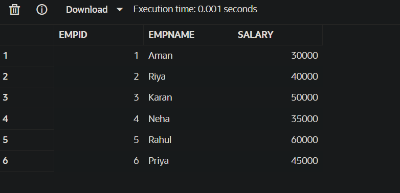

# README – Experiment 7

## Design and Performance Analysis of Materialized Views

---

## 📌 Overview

This experiment focuses on understanding and analyzing the performance differences between:

- **Simple Views**
- **Complex Views**
- **Materialized Views**

It demonstrates how materialized views improve query performance by storing precomputed results, which is crucial in large-scale enterprise systems (like SandDisk, JTG, PayPal).

---

## 🎯 Aim

To design and implement:

- Simple views
- Complex views
- Materialized views

And analyze their execution time and performance differences.

---

## 🎯 Objectives

- Understand the concept of views and materialized views
- Create simple and complex views
- Implement materialized views
- Compare query performance
- Analyze execution time differences
- Understand real-world use cases

---

## 🛠️ Technologies Used

- Oracle Database Express Edition (Oracle XE)
- PostgreSQL
- Oracle SQL Developer / pgAdmin
- SQL

---

## 🧠 Concepts Covered

### 🔹 1. Simple View

- Based on a single table
- No aggregation or joins
- Lightweight and easy to use

👉 **Example use case:** Display employee details

### 🔹 2. Complex View

- Uses joins, GROUP BY, aggregations
- More computationally expensive
- Computed at runtime

👉 **Example use case:** Department-wise salary analysis

### 🔹 3. Materialized View

- Stores query result physically
- Faster query execution
- Requires refresh

👉 **Example use case:** Frequently used reports

---

## ⚖️ Comparison

| Feature | Simple View | Complex View | Materialized View |
|---------|-------------|--------------|-------------------|
| Data Storage | ❌ No | ❌ No | ✅ Yes |
| Performance | Medium | Slow | Fast |
| Computation | Runtime | Heavy Runtime | Precomputed |
| Use Case | Basic queries | Analytical queries | High-performance systems |

---

## 🏗️ Project Structure

```
Experiment-7/
│
├── README.md
├── views_experiment.sql
└── output/
```

---

## ⚙️ Setup Instructions

1. Open Oracle SQL Developer / pgAdmin
2. Create database connection
3. Enable execution output
4. Run SQL queries step by step
5. Measure execution time

---

## 🧪 Implementation

### 🔹 Step 1: Create Table

```sql
CREATE TABLE Employee (
    EmpID NUMBER PRIMARY KEY,
    EmpName VARCHAR2(50),
    Salary NUMBER,
    DeptID NUMBER
);
```

### 🔹 Step 2: Insert Data

```sql
INSERT INTO Employee VALUES (1, 'Aman', 30000, 10);
INSERT INTO Employee VALUES (2, 'Riya', 40000, 20);
INSERT INTO Employee VALUES (3, 'Karan', 50000, 10);
INSERT INTO Employee VALUES (4, 'Neha', 35000, 30);
INSERT INTO Employee VALUES (5, 'Rahul', 60000, 20);
INSERT INTO Employee VALUES (6, 'Priya', 45000, 10);

COMMIT;
```

### 🔹 Step 3: Create Simple View

```sql
CREATE VIEW simple_view AS
SELECT EmpID, EmpName, Salary
FROM Employee;
```

### 🔹 Step 4: Create Complex View

```sql
CREATE VIEW complex_view AS
SELECT DeptID, COUNT(*) AS total_emp, AVG(Salary) AS avg_salary
FROM Employee
GROUP BY DeptID;
```

### 🔹 Step 5: Create Materialized View (Oracle)

```sql
CREATE MATERIALIZED VIEW mv_employee
BUILD IMMEDIATE
REFRESH COMPLETE
AS
SELECT DeptID, COUNT(*) AS total_emp, AVG(Salary) AS avg_salary
FROM Employee
GROUP BY DeptID;
```

### 🔹 Step 6: Query Execution

```sql
-- Simple View
SELECT * FROM simple_view;

-- Complex View
SELECT * FROM complex_view;

-- Materialized View
SELECT * FROM mv_employee;
```

---

## ⏱️ Performance Analysis

| Query Type | Execution Time | Observation |
|------------|----------------|-------------|
| Simple View | Fast | Direct table access |
| Complex View | Slower | Computation at runtime |
| Materialized View | Fastest | Precomputed results |

---

## 📸 Output Screenshots

### Result 1 


### Result 2 


---


## 🔍 Key Observations

- Simple views are fast but limited
- Complex views are flexible but slower
- Materialized views significantly improve performance
- Best suited for repeated queries

---

## ⚠️ Important Concept: Refresh

Materialized views must be refreshed to stay updated.

```sql
-- Oracle
REFRESH MATERIALIZED VIEW mv_employee;
```

---

## 🚀 Real-World Applications

- Business dashboards
- Reporting systems
- Data warehousing
- Financial analytics (PayPal-type systems)
- Large-scale enterprise queries

---

## ⚡ Best Practices

- Use materialized views for frequent queries
- Avoid overusing complex views
- Schedule refresh properly
- Balance between performance and data freshness

---

## 💡 Advanced Insight (Interview Level)

👉 **Why materialized view is faster?**

Because:

- Data is already stored
- No need to recompute joins/aggregations
- Reduces CPU + I/O usage

---

## 🎓 Learning Outcome

After completing this experiment, you will:

- Understand views vs materialized views
- Improve query optimization skills
- Analyze performance differences
- Apply concepts in real-world systems

---


## 📌 Conclusion

This experiment demonstrates that **materialized views are highly effective** for optimizing performance in systems where complex queries are executed frequently. They play a critical role in enterprise-level applications by reducing computation time and improving efficiency.

---

## 📝 License

This project is created for educational purposes.

---

## 👨‍💻 Author

Gurkirat Singh Bhangoo
---

**Happy Learning! 🚀**