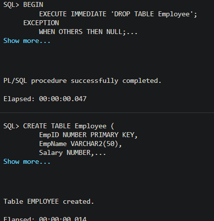
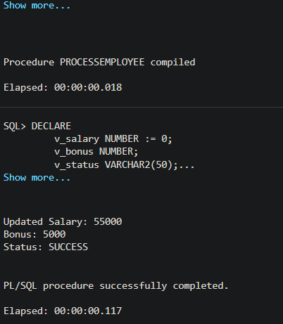

# 🧪 DBMS Experiment: Stored Procedures in PL/SQL

## 📌 Title

**Design and Implementation of Stored Procedures Using IN, OUT, and INOUT Parameters in PL/SQL**

---

## 🎯 Aim

To design and implement a parameterized stored procedure in PL/SQL that demonstrates the use of different parameter modes (**IN, OUT, and INOUT**) for processing employee data and encapsulating business logic.

---

## 🎯 Objectives

* To understand the concept and working of stored procedures in PL/SQL
* To implement parameterized procedures using IN, OUT, and INOUT modes
* To perform data manipulation and calculations within a procedure
* To demonstrate modular programming and code reusability
* To execute stored procedures using anonymous PL/SQL blocks

---

## 🧠 Background & Theory

A **stored procedure** is a precompiled collection of SQL and PL/SQL statements stored in the database. It is used to perform specific operations and can be reused multiple times, improving performance and maintainability.

### 🔹 Parameter Modes in PL/SQL

* **IN Parameter**

  * Used to pass input values to the procedure
  * Read-only within the procedure

* **OUT Parameter**

  * Used to return values from the procedure
  * Must be assigned before returning

* **INOUT Parameter**

  * Used for both input and output
  * Allows modification of input values and returning updated results

---

## 🗄️ Database Schema

### Table: Employee

| Column Name | Data Type    | Description     |
| ----------- | ------------ | --------------- |
| EmpID       | NUMBER       | Primary Key     |
| EmpName     | VARCHAR2(50) | Employee Name   |
| Salary      | NUMBER       | Employee Salary |
| DeptID      | NUMBER       | Department ID   |

---

## ⚙️ Procedure Description

The stored procedure `ProcessEmployee` performs the following tasks:

1. Accepts an employee ID as input
2. Retrieves the employee’s salary
3. Calculates a bonus (10% of salary)
4. Updates the employee’s salary by adding the bonus
5. Returns:

   * Calculated bonus (OUT parameter)
   * Updated salary (INOUT parameter)
   * Execution status (OUT parameter)

---

## 🧪 Implementation Steps

1. Create the `Employee` table
2. Insert sample records
3. Define the stored procedure using parameter modes
4. Execute the procedure using an anonymous block
5. Display results using `DBMS_OUTPUT`

---

## ▶️ Execution

The procedure is invoked using an anonymous PL/SQL block, passing required parameters and capturing outputs.

---

## 📊 Sample Output

```
Updated Salary: 55000
Bonus: 5000
Status: SUCCESS
```
---

## 📸 Output Screenshots

### Result 1 


### Result 2 


--- 

## ⚠️ Exception Handling

The procedure includes exception handling to ensure robustness:

* **NO_DATA_FOUND** → Triggered when employee ID does not exist
* **OTHERS** → Handles unexpected runtime errors

---

## ✅ Result

The stored procedure was successfully implemented and executed.
It demonstrated:

* Effective use of IN, OUT, and INOUT parameters
* Modular and reusable database programming
* Proper exception handling and data manipulation

---

## 🔍 Discussion

This experiment highlights the importance of:

* Encapsulating business logic within the database
* Reducing redundancy through reusable procedures
* Improving performance via precompiled execution
* Enhancing maintainability and scalability

---

## 📌 Applications

* Payroll systems
* Employee management systems
* Enterprise database applications
* Backend logic in large-scale systems

---

## 🏁 Conclusion

The experiment successfully demonstrated the implementation of stored procedures in PL/SQL using multiple parameter modes. It reinforced the concept of modular programming and showcased how business logic can be efficiently managed within the database layer.

---

## 📚 References

* Oracle PL/SQL Documentation
* Database System Concepts by Silberschatz
* Oracle SQL Developer Guides

---

## 👨‍💻 Author

**Gurkirat Singh**
B.Tech (AI & ML)
Chandigarh University

---
