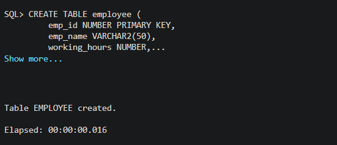
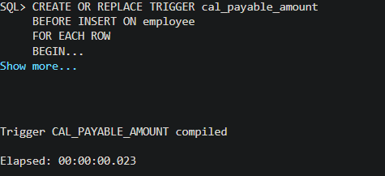
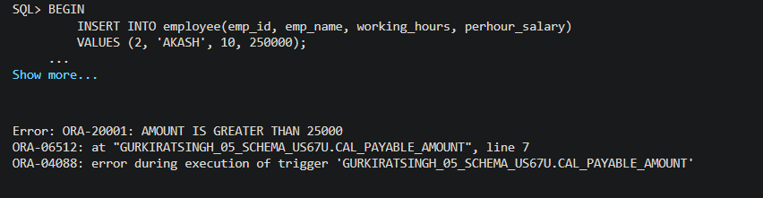
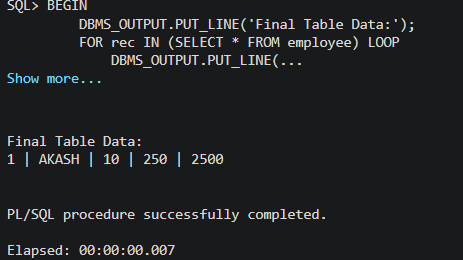

# 🧪 DBMS Experiment: Trigger for Salary Calculation (Oracle PL/SQL)

---

## 📌 Title  
**Automatic Salary Calculation and Validation using Triggers in Oracle**

---

## 🎯 Aim  
To design and implement a **trigger in Oracle PL/SQL** that automatically calculates the total payable amount of an employee and enforces a constraint to restrict excessive salary values.

---

## 🎯 Objectives  

- To understand the concept of **database triggers**
- To implement a **BEFORE INSERT trigger**
- To automate calculation of salary
- To enforce business rules using triggers
- To handle exceptions in PL/SQL

---

## 🧠 Theory  

A **trigger** is a database object that automatically executes when a specified event occurs (INSERT, UPDATE, DELETE).

### 🔹 In this experiment:
- Trigger Type → **BEFORE INSERT**
- Purpose:
  - Automatically calculate salary  
  - Prevent invalid data entry  

### 🔹 Formula Used:
Total Payable Amount = Working Hours × Per Hour Salary

### 🔹 Constraint:
- If total amount > 25000 → ❌ Reject insertion

---

## 🗄️ Table Structure  

| Column Name            | Data Type   |
|------------------------|------------|
| emp_id                | NUMBER (PK)|
| emp_name              | VARCHAR2   |
| working_hours         | NUMBER     |
| perhour_salary        | NUMBER     |
| total_payable_amount  | NUMBER     |

---

## ⚙️ Implementation  

### 🔹 Trigger Logic
- Calculates total salary
- Validates condition
- Raises error if violated

---

## 📸 Execution Screenshots  

### 🟢 1. Table Creation  

---

### 🟢 2. Trigger Creation  

---

### 🔴 3. Invalid Insert (Error Handling)  

---

### 🟢 4. Final Table Output  

---

## ⚠️ Exception Handling  

- Used `RAISE_APPLICATION_ERROR`
- Prevents invalid data insertion
- Error captured using `WHEN OTHERS`

---

## 📊 Result  

- Trigger successfully calculates salary ✔  
- Prevents insertion when salary exceeds limit ✔  
- Ensures data integrity ✔  

---

## 🔍 Discussion  

This experiment demonstrates:
- Automation using triggers  
- Enforcing business rules at database level  
- Improving data consistency  
- Reducing dependency on application logic  

---

## 📌 Applications  

- Payroll Systems  
- HR Management Systems  
- Financial Validation Systems  

---

## 🏁 Conclusion  

The trigger was successfully implemented to automate salary calculation and enforce constraints. This ensures that only valid data is stored in the database, improving reliability and consistency.

---

## 👨‍💻 Author  

**Gurkirat SIngh Bhangoo**  
B.Tech (AI & ML)

---