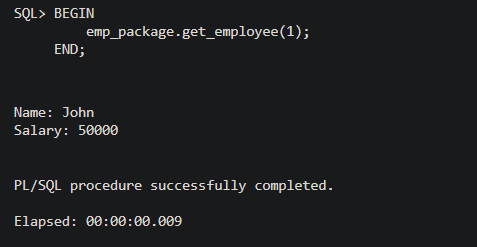
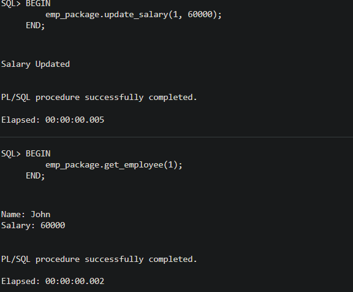
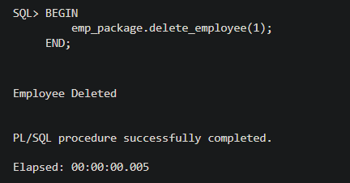

# 🧪 EXPERIMENT – 09

## Implementation of Packages in PL/SQL (CRUD Operations)

---

## 📌 Overview

This experiment demonstrates the implementation of **PL/SQL Packages in Oracle** to perform CRUD (Create, Read, Update, Delete) operations on an `employees` table. The package provides a modular and reusable approach for handling database operations efficiently.

---

## 🎯 Aim

To design and implement a PL/SQL package that performs CRUD operations on a database table in a structured and reusable manner.

---

## 🛠️ Tools Used

* Oracle SQL*Plus / SQL Developer
* PL/SQL

---

## 📚 Objectives

* Understand PL/SQL package structure (Specification & Body)
* Implement modular database logic
* Perform CRUD operations using stored procedures
* Use DBMS_OUTPUT for displaying results
* Handle exceptions in PL/SQL
* Improve performance and reusability

---

## 🧠 Theory

A **PL/SQL package** is a collection of procedures, functions, variables, and cursors grouped together as a single unit.

It consists of:

* **Package Specification** → Declares procedures/functions
* **Package Body** → Implements logic

### 🔹 Advantages

* Improves performance (loaded once in memory)
* Provides modularity
* Enhances security
* Promotes code reusability

---

## ⚙️ Implementation Steps

### Step 1: Create Table

* Created `employees` table with columns:

  * emp_id (Primary Key)
  * emp_name
  * salary

📸 Screenshot:

---

### Step 2: Create Package Specification

* Declared procedures:

  * add_employee
  * get_employee
  * update_salary
  * delete_employee

📸 Screenshot:

---

### Step 3: Create Package Body

* Implemented logic for all CRUD operations
* Used SQL queries inside procedures
* Added exception handling

📸 Screenshot:

---

### Step 4: Insert Operation

* Added employee record using package

📸 Screenshot:

---

### Step 5: Read Operation

* Retrieved employee details

📸 Screenshot:

---

### Step 6: Update Operation

* Updated employee salary

📸 Screenshot:

---

### Step 7: Delete Operation

* Deleted employee record

📸 Screenshot:

---

## 🔍 Detailed I/O Analysis

### ✅ Input

* SQL commands for table creation
* Package specification & body
* Procedure calls using anonymous PL/SQL blocks
* Input values:

  * emp_id
  * emp_name
  * salary

---

### ✅ Output

* Employee Added successfully
* Display of employee name and salary
* Salary updated successfully
* Updated values displayed
* Employee deleted successfully
* Proper execution messages from PL/SQL

---

## 📊 Result

The PL/SQL package was successfully created and executed. All CRUD operations were performed correctly using modular procedures, demonstrating efficient database programming.

---

## 🎓 Learning Outcome

* Learned structure of PL/SQL packages
* Understood modular programming in databases
* Gained hands-on experience with CRUD operations
* Improved knowledge of exception handling
* Learned real-world backend database logic

---

## 🚀 Conclusion

This experiment demonstrates how PL/SQL packages improve database performance, maintainability, and reusability. Such implementations are widely used in enterprise-level applications.

---

## 👨‍💻 Author  

**Gurkirat SIngh Bhangoo**  
B.Tech (AI & ML)

---